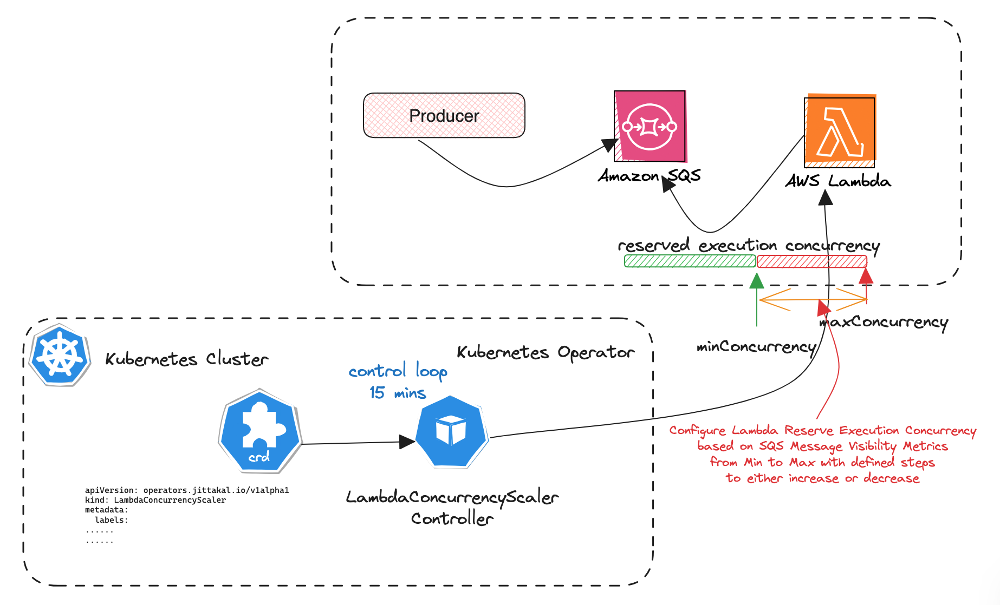

# AWS Lambda Concurrency Scaler Kubernetes Operator

## Overview

The Kubernetes Operator for AWS Lambda Reserved Concurrency Dynamic Adjustment based on SQS specific metrics.


## Use-case:

In an AWS serverless architecture, where messages are published into an SQS queue and consumed by an AWS Lambda function with predefined concurrency execution configuration, there arises a scenario where the producer-side is publishing messages at a high rate. To ensure faster processing and reduce end-to-end latency in message handling, the concurrency of the Lambda function can be dynamically adjusted based on the available visibility metrics of messages in the SQS queue.


## Solution Overview

To implement this dynamic concurrency configuration adjustment, we leverage the Kubernetes Operator pattern to introduce an AutoScaling-like capability for the AWS Lambda function's reserved concurrency execution configuration. In this setup, the AWS Lambda function is treated as an external custom resource, and the custom resource definition specification accepts the following information:

- *SQS Name:* The name of the SQS queue where messages are being published.
- *SQS Message Threshold:* A threshold indicating the number of messages in the SQS queue that triggers adjustments to the Lambda function concurrency.
- *Lambda Function Name:* The name of the AWS Lambda function whose concurrency will be dynamically adjusted.
- *Minimum Concurrency:* The minimum allowed concurrency level for the Lambda function.
- *Maximum Concurrency:* The maximum allowed concurrency level for the Lambda function.
- *Step Concurrency:* The incremental or decremental step size for adjusting the Lambda function concurrency based on SQS metrics.



This Kubernetes Operator will periodically monitor the SQS queue, analyze the visibility metrics of messages, and adjust the Lambda function's concurrency within the specified minimum and maximum limits. This dynamic scaling mechanism ensures optimal resource utilization and responsiveness to varying workloads, providing an efficient and adaptive solution for message processing in the serverless architecture.

## How it works

- Clone kubernetes operator repository

```bash
$ cd ~\workspace\git.ws
$ git clone https://github.com/jittakal/lambda-con-scaler-operator.git
$ cd lambda-con-scaler-operator
```

- Pre-requisite step - create operator-system namespace & secret

Create namesapce

```bash
$ kubectl create namespace lambda-conc-scaler-operator-system
```

Create `lambdaconcurrencyscaler-secret` use sample yaml with base64 encoded AWS secrets have only permission to read SQS queue metrics and read / write permissions for AWS Lambda function

```yaml
apiVersion: v1
kind: Secret
metadata:
  name: lambdaconcurrencyscaler-secret
  namespace: lambda-con-scaler-operator-system
type: Opaque
data:
  AWS_ACCESS_KEY_ID: <<base64-encoded-aws-access-key-id>>
  AWS_SECRET_ACCESS_KEY: <<base64-encoded-aws-secret-access-key>>
```

```bash
$ kubectl apply -f secret.yaml
$ kubectl get secrets -n lambda-con-scaler-operator-system
```

- Deploy Operator

```bash
$ make deploy
```

- Verify Operator deployment

```bash
$ kubectl get crds

$ kubectl get LambdaConcurrencyScaler
```

- Create custom (LambdaConcurrencyScaler) resource

Create new or edit config/samples/aws_v1alpha1_lambdaconcurrencyscaler.yaml file
```yaml
apiVersion: aws.operators.jittakal.io/v1alpha1
kind: LambdaConcurrencyScaler
metadata:
  labels:
    app.kubernetes.io/name: lambdaconcurrencyscaler
    app.kubernetes.io/instance: lambdaconcurrencyscaler-sample
    app.kubernetes.io/part-of: lambda-con-scaler-operator
    app.kubernetes.io/managed-by: kustomize
    app.kubernetes.io/created-by: lambda-con-scaler-operator
  name: lambdaconcurrencyscaler-sample
spec:
  awsSQSName: <<sqsName>>
  awsSQSMsgCountThreshold: <<1000>>
  awsLambdaName: <<lambdaFunctionName>>
  awsLambdaMinConcurrency: <<50>>
  awsLamndaMaxConcurrency: <<100>>
  awsLambdaStepConcurrency: <<5>>
```

Create

```bash
$ kubectl apply -f config/samples/aws_v1alpha1_lambdaconcurrencyscaler.yaml
```

Verify

```bash
$ kubectl get LambdaConcurrencyScaler
```

## Reference

- Docker image - [kubernetes operator lambda concurrency scaler](https://hub.docker.com/repository/docker/jittakal/lambda-con-scaler-operator/general)
